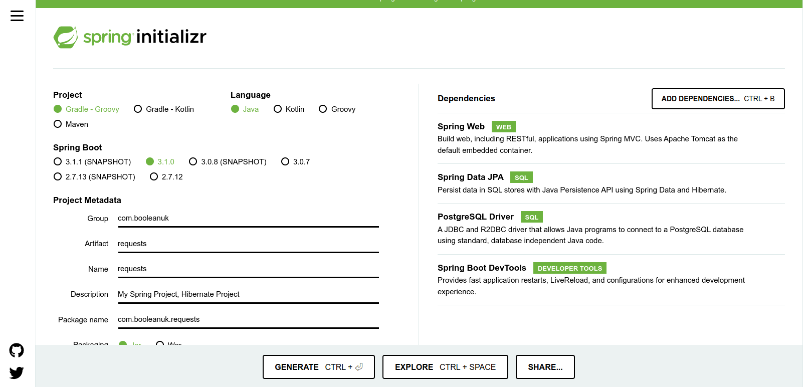

# Java APIs, MVC, JPA and Hibernate Workshop

## Learning Objectives
- Explain that an Object Relational Mapper maps database tables directly to objects in code
- Explain that an ORM removes the need to write SQL or interact with a database directly
- Explain the trade-offs between the convenience of an ORM and the control of writing SQL
- Use Spring JPA and Hibernate to implement the Model layer of an API
- Use Hibernate repositories to provide data interfaces for controllers

## Instructions

1. Fork this repository
2. Clone your fork to your machine
3. Open the project in IntelliJ

## Goal

We are going to create a database backed API, similar to the ones you have already developed previously, but this time we are going to look at ways of using Hibernate and JP so that we can use Java for the vast majority of the steps we will be using. That way we won't need to write SQL and use it to create our tables, which we then have to convert to java and design classes around.

## Setting up the Project

Instead, we will write Java classes which will represent our database tables and use those to generate the tables in the database. There are a lot of moving pieces that we need to build to make that happen though. This project will already be set up with the correct dependencies for you to use, but if you wish to create your own from scratch you will need to start with the Spring Initializr as we did previously. Set up the project with settings that match the following:



Clicking on `Generate` will download the skeleton project, unzip the download where you plan on working on it, and open the folder with IntelliJ.

In the folder open the `build.gradle` file, it will currently look like this:

```groovy
plugins {
	id 'java'
	id 'org.springframework.boot' version '3.1.0'
	id 'io.spring.dependency-management' version '1.1.0'
}

group = 'com.booleanuk'
version = '0.0.1-SNAPSHOT'
sourceCompatibility = '17'

repositories {
	mavenCentral()
}

dependencies {
	implementation 'org.springframework.boot:spring-boot-starter-data-jpa'
	implementation 'org.springframework.boot:spring-boot-starter-web'
	developmentOnly 'org.springframework.boot:spring-boot-devtools'
	runtimeOnly 'org.postgresql:postgresql'
	testImplementation 'org.springframework.boot:spring-boot-starter-test'
}

tasks.named('test') {
	useJUnitPlatform()
}
```

Change the line that currently says `runtimeonly 'org.postgresql:postgresql` to read `implementation 'org.postgresql:postgresql:42.6.0'` instead (which is what we used when we were talking directly to the database from Java in a previous session). After the change the `build.gradle` file will look like this:

```groovy
plugins {
	id 'java'
	id 'org.springframework.boot' version '3.1.0'
	id 'io.spring.dependency-management' version '1.1.0'
}

group = 'com.booleanuk'
version = '0.0.1-SNAPSHOT'
sourceCompatibility = '17'

repositories {
	mavenCentral()
}

dependencies {
	implementation 'org.springframework.boot:spring-boot-starter-data-jpa'
	implementation 'org.springframework.boot:spring-boot-starter-web'
	developmentOnly 'org.springframework.boot:spring-boot-devtools'
    implementation 'org.postgresql:postgresql:42.6.0'
	testImplementation 'org.springframework.boot:spring-boot-starter-test'
}

tasks.named('test') {
	useJUnitPlatform()
}
```

Run the Gradle sync tool to update the dependencies.

## Setting up the Connection to the Database

In this project there is an `application.yml.example` file which includes some example connection details. In your new project go into the `.gitignore` file and add

```bash
### User Defined ###
src/main/resources/application.yml
```

if you miss this step, then you risk sharing your actual settings with the world via GitHub.

Then copy, paste and rename the `application.yml.example` file to be just `application.yml` into the same folder (so in your project you would need to add a `resources` folder to `src/main` and paste the renamed file into there).

Currently the (new) `application.yml` file contains:

```yaml
server:
  port: 4000
  error:
    include-message: always
    include-binding-errors: always
    include-stacktrace: never
    include-exception: false

spring:
  datasource:
    url: jdbc:postgresql://DATABASE_URL:5432/DATABASE_USERNAME
    username: DATABASE_USERNAME
    password: DATABASE_PASSWORD
    max-active: 5
    max-idle: 5
  jpa:
    hibernate:
      ddl-auto: update
    properties:
      hibernate:
        dialect: org.hibernate.dialect.PostgreSQLDialect
        format_sql: true
    show-sql: true
```

You need to update the `DATABASE_URL`, `DATABASE_USERNAME` and `DATABASE_PASSWORD` to match your settings on ElephantSQL.

## An Employees API

We're going to create an API which manages Employees to begin with, but rather than building the Employees table directly using SQL and Flyway we're going to use Java to create the Employees table and add data to it, and then use Spring Boot to handle the normal API calls that we have been implementing.

The Employee table is going to have the following fields: id, firstName, lastName, location, and email.

Clear out any legacy tables from your ElephantSQL instance, so that there is plenty of rooom to create new ones.

In the `com.boolean.api` package create a new package called `model` and add a class to it called Employee, this will work the same way that the classes we created last week, in that it will hold individual records from the database Employee table, but instead of us defining the table in the database separately, our tools will take this class, check if it exists in the database, and create it if it does not. If it exists in the database already, then it will use the pre-existing one.

```java
package com.booleanuk.api.model;

import jakarta.persistence.*;

@Entity
@Table(name = "employees")
public class Employee {
    @Id
    @GeneratedValue(strategy = GenerationType.IDENTITY)
    private int id;

    @Column(name = "first_name")
    private String firstName;

    @Column(name = "last_name")
    private String lastName;

    @Column(name = "location")
    private String location;

    @Column(name = "email_address")
    private String email;

    public Employee() {

    }

    public Employee(String firstName, String lastName, String location, String email) {
        super();
        this.firstName = firstName;
        this.lastName = lastName;
        this.location = location;
        this.email = email;
    }

    public int getId() {
        return this.id;
    }

    public void setId(int id) {
        this.id = id;
    }

    public String getFirstName() {
        return this.firstName;
    }

    public void setFirstName(String firstName) {
        this.firstName = firstName;
    }

    public String getLastName() {
        return this.lastName;
    }

    public void setLastName(String lastName) {
        this.lastName = lastName;
    }

    public String getLocation() {
        return this.location;
    }

    public void setLocation(String location) {
        this.location = location;
    }

    public String getEmail() {
        return this.email;
    }

    public void setEmail(String email) {
        this.email = email;
    }
}
```

`@Entity` tells the Java Persistence API which is now called Jakarta Persistence that this class is something it should be concerned with as it will map to some sort of database entity. The `@Table` and `@Column` annotations are used to show it that this is going to be a table with the columns labelled as shown in the annotations. If we did a Select query and received an `Employee` object back then the data from each field (column) would map across to the fields in the class. The `@Id` annotation tells it that the value contained in the `id` field will be the Primary Key for the object and `@GeneratedValue` part tells it that the value will be generated by the database.

In the `com.booleanuk.api` package create a new package called repository and add a new Interface to it called `EmployeeRepository`. In that Interface add the following:

```java
package com.booleanuk.api.repository;

import com.booleanuk.api.model.Employee;
import org.springframework.data.jpa.repository.JpaRepository;

public interface EmployeeRepository extends JpaRepository<Employee, Integer> {

}
```

This tells JpaRepository about the Employee class and how it relates to the EmployeeRepository.

Next in the `com.booleanuk.api` package create a new package called controller and add a new `EmployeeController` class inside it.

By making use of the `@Autowired` annotation we can link our `EmployeeRepository` class into this new class without needing to instantiate a new instance of it.

```java
package com.booleanuk.api.controller;

import com.booleanuk.api.model.Employee;
import com.booleanuk.api.repository.EmployeeRepository;
import org.springframework.beans.factory.annotation.Autowired;
@RestController
@RequestMapping("employees")
public class EmployeeController {

    @Autowired
    private EmployeeRepository employeeRepository;
}
```

Add in the code to get all of the employees.

```java
package com.booleanuk.api.controller;

import com.booleanuk.api.model.Employee;
import com.booleanuk.api.repository.EmployeeRepository;
import org.springframework.beans.factory.annotation.Autowired;
import org.springframework.web.bind.annotation.*;

import java.util.List;

@RestController
@RequestMapping("employees")
public class EmployeeController {

    @Autowired
    private EmployeeRepository employeeRepository;

    @GetMapping
    public List<Employee> getAllEmployees() {
        return this.employeeRepository.findAll();
    }
}
```

The automagically created code provides the EmployeeRepository class with a `fineAll()` method that we can use without needing to write it.

Run the code and test it works (you might want to manually add some entries to the database, so that something is returned).

You'll notice that we make use of an annotation called `@Autowired` which is one of the ways that the Spring Framework manages dependency injection (the others include `@Resource` and `@Inject`) we aren't going to go through them in detail, but more information can be found in the documentation as well as [here](https://www.baeldung.com/spring-annotations-resource-inject-autowire).

We can add code to create the other endpoints in a similar way, to what we've done previously:

```java
package com.booleanuk.api.controller;

import com.booleanuk.api.model.Employee;
import com.booleanuk.api.repository.EmployeeRepository;
import org.springframework.beans.factory.annotation.Autowired;
import org.springframework.http.HttpStatus;
import org.springframework.http.ResponseEntity;
import org.springframework.web.bind.annotation.*;
import org.springframework.web.server.ResponseStatusException;

import java.util.List;

@RestController
@RequestMapping("employees")
public class EmployeeController {

    @Autowired
    private EmployeeRepository employeeRepository;

    @GetMapping
    public List<Employee> getAllEmployees() {
        return this.employeeRepository.findAll();
    }

    @PostMapping
    public ResponseEntity<Employee> createEmployee(@RequestBody Employee employee) {
        return new ResponseEntity<Employee>(this.employeeRepository.save(employee), HttpStatus.CREATED);
    }

    @GetMapping("/{id}")
    public ResponseEntity<Employee> getEmployeeById(@PathVariable int id) {
        Employee employee = null;
        employee = this.employeeRepository.findById(id).orElseThrow(() -> new ResponseStatusException(HttpStatus.NOT_FOUND, "Not found"));
        return ResponseEntity.ok(employee);
    }

    @PutMapping("/{id}")
    public ResponseEntity<Employee> updateEmployee(@PathVariable int id, @RequestBody Employee employee) {
        Employee employeeToUpdate = this.employeeRepository.findById(id).orElseThrow(() -> new ResponseStatusException(HttpStatus.NOT_FOUND, "Not found"));

        employeeToUpdate.setFirstName(employee.getFirstName());
        employeeToUpdate.setLastName(employee.getLastName());
        employeeToUpdate.setEmail(employee.getEmail());
        employeeToUpdate.setLocation(employee.getLocation());
        return new ResponseEntity<Employee>(this.employeeRepository.save(employeeToUpdate), HttpStatus.CREATED);
    }

    @DeleteMapping("/{id}")
    public ResponseEntity<Employee> deleteEmployee(@PathVariable int id) {
        Employee employeeToDelete = this.employeeRepository.findById(id).orElseThrow(() -> new ResponseStatusException(HttpStatus.NOT_FOUND, "Not found"));
        this.employeeRepository.delete(employeeToDelete);
        return ResponseEntity.ok(employeeToDelete);
    }
}
```

There are a couple of other things to be aware of `.findById(id).orElseThrow(() -> new ResponseStatusException(HttpStatus.NOT_FOUND, "Not found"))` either returns the object or throws the status exception and is a quick way of writing our own version of this as we did previously.

The `ResponseEntity` object is a way of building in the response codes when we return an object from the methods. It has a number of built in methods (we've used `ok` to provide a 200 signal) but they don't always return the exact combination we need which is why for some we have returned `new` ResponseEntity objects with explicit codes.

## Core Exercise

Implement the Core Spec which can be found in the webpage [here](https://boolean-uk.github.io/java-api-jpa-hibernate-workshop/), use hibernate and other tools to do this as efficiently as possible.

## Extension Exercise

Extend the code from the core exercise to fully implement the Extension Spec which can be found in the webpage [here](https://boolean-uk.github.io/java-api-jpa-hibernate-workshop/extensions.html).


